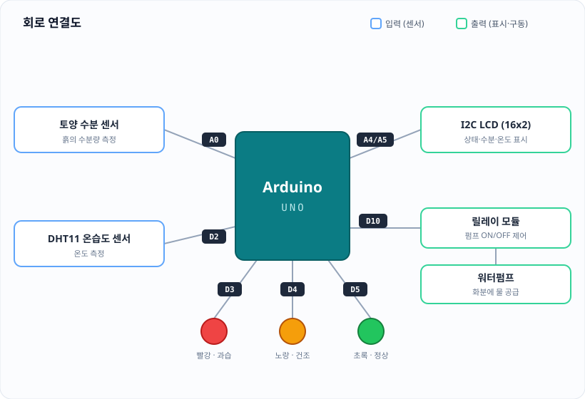

# 🌱 식물 돌봄 시스템


> *"바쁜 일상 속 식물을 돌보지 못해 식물이 죽는 것을 방지하기 위함."*

## 프로젝트 개요

토양 수분 센서로 식물의 상태를 실시간으로 감지하고, 흙이 마르면 워터펌프로 **자동 급수**하며, 웹 대시보드로 상태를 **모니터링**하는 스마트 화분 시스템입니다.

아두이노가 센서 값을 읽어 식물 상태를 판별하고, 파이썬(Streamlit) 대시보드가 시리얼 통신(JSON)으로 데이터를 주고받으며 시각화와 펌프 제어를 담당합니다.

- 🌱 **상태 감지** — 토양 수분으로 `THIRSTY · FINE · OVERFLOW` 3단계 판별, 상태 LED와 I2C LCD로 즉시 표시
- 💧 **자동 급수** — 건조 감지 시 워터펌프 2초 작동, 30초 쿨다운으로 과습 방지
- 📊 **실시간 대시보드** — Streamlit으로 수분·온도 추세, 이동평균, 통계 시각화

### 동기

> 바쁜 일상 속 식물을 돌보지 못해 식물이 죽는 것을 방지하기 위함.

물 주는 것을 자주 잊고, 흙 속의 적정 수분량은 눈으로 판단하기 어렵습니다. 과습과 건조가 반복되면 식물은 쉽게 죽습니다. 센서와 워터펌프로 이 과정을 자동화해, 자리를 비워도 식물이 마르지 않도록 합니다.

### 해결방안

처음에는 센서 6종·액추에이터 4종(총 10개 부품)을 구상했지만, 전력 설계 부담과 디버깅 난이도를 고려해 **핵심 3가지 기능부터 검증하고 확장**하는 방향으로 좁혔습니다.

1. **토양 수분 감지 · 상태 판별** — 토양 수분 센서값으로 식물 상태를 3단계로 판별합니다. (`> 950` 건조 / `< 300` 과습 / 그 외 정상) 판별 결과는 상태 LED와 I2C LCD에 즉시 표시됩니다.
2. **자동 급수** — 건조(`THIRSTY`) 상태를 감지하면 릴레이로 워터펌프를 2초간 작동시켜 급수하고, 30초 쿨다운으로 과습을 방지합니다.
3. **실시간 대시보드** — 아두이노가 1초마다 보내는 JSON 데이터를 Streamlit 대시보드가 받아 수분·온도 추세, 이동평균, 통계, 원본 데이터를 시각화하고 자동 급수를 제어합니다.

### 회로도



### 사용 부품

| 부품 | 핀 | 역할 |
|---|---|---|
| 토양 수분 센서 | A0 | 흙의 수분량 측정 |
| DHT11 온습도 센서 | D2 | 온도 측정 |
| 릴레이 모듈 (워터펌프) | D10 | 펌프 ON/OFF 제어 |
| 빨강 LED | D3 | 과습(OVERFLOW) 표시 |
| 노랑 LED | D4 | 건조(THIRSTY) 표시 |
| 초록 LED | D5 | 정상(FINE) 표시 |
| I2C LCD (16x2) | I2C (0x27) | 상태·수분·온도 표시 |


## 🛠️ 환경 설정 및 프로그램 설치 (Setup)

### 1. 아두이노 라이브러리 설치

#### 사용한 라이브러리

- [ArduinoJson 7](https://arduinojson.org/) — 아두이노 ↔ 파이썬 JSON 통신
- [DHT sensor library](https://github.com/adafruit/DHT-sensor-library) — DHT11 온습도 센서
- [LiquidCrystal_I2C](https://github.com/johnrickman/LiquidCrystal_I2C) — I2C LCD(16x2) 출력
- `Wire` — I2C 통신 (아두이노 IDE 기본 내장, 별도 설치 불필요)


### 2. 파이썬 라이브러리 설치 (Libraries)
VS Code의 터미널(Terminal)창을 열고 아래 명령어를 복사해서 붙여넣으세요. 이 과정에서 필요한 모든 라이브러리가 자동으로 설치됩니다.

```Bash
pip install -r requirements.txt
```
💡 팁: 명령어를 입력한 뒤 **엔터(Enter)**를 누르고, 설치가 완료될 때까지 잠시 기다려 주세요.

⚠️ 주의: 반드시 VS Code에서 프로젝트 폴더가 열려 있는 상태여야 합니다. (왼쪽 파일 목록에 requirements.txt가 보여야 해요!)

📦 포함된 라이브러리 목록
requirements.txt 파일에는 우리가 사용할 아래의 도구들이 들어있습니다.

```
streamlit==1.55.0
pyserial==3.5
pandas==2.3.3
python-dotenv==1.2.2
watchdog==6.0.0
```
- `streamlit`: 복잡한 웹 기술 없이도 파이썬만으로 실시간 데이터 대시보드를 만듭니다.

- `pandas`: 아두이노에서 들어온 수많은 데이터를 표(Table) 형식으로 일목요연하게 정리합니다.

- `pyserial`: 아두이노와 파이썬 사이의 대화 통로를 엽니다.

- `python-dotenv`: API 키와 같은 민감한 비밀 정보를 코드와 분리하여 안전하게 관리합니다.

- `watchdog`: 코드나 파일의 변화를 감시하여 대시보드에 즉각 반영되도록 돕습니다.

## ⚡ 프로젝트 실행 방법 (How to Run)

### 🔌 1. 아두이노 연결 및 업로드

- 아두이노 보드를 컴퓨터 USB 포트에 연결하세요.

- 아두이노 IDE에서 작성한 .ino 파일을 보드에 업로드(Upload) 합니다.

### 🖥️ 2. VS Code 터미널 열기

- 단축키 Ctrl + `를 누르거나, 상단 메뉴에서 [터미널] -> [새 터미널]을 클릭하세요.

- 터미널 창에 아래 명령어를 복사해서 붙여넣고 엔터를 누르세요.

```Bash
streamlit run app.py
```